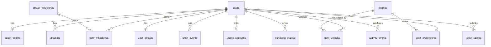
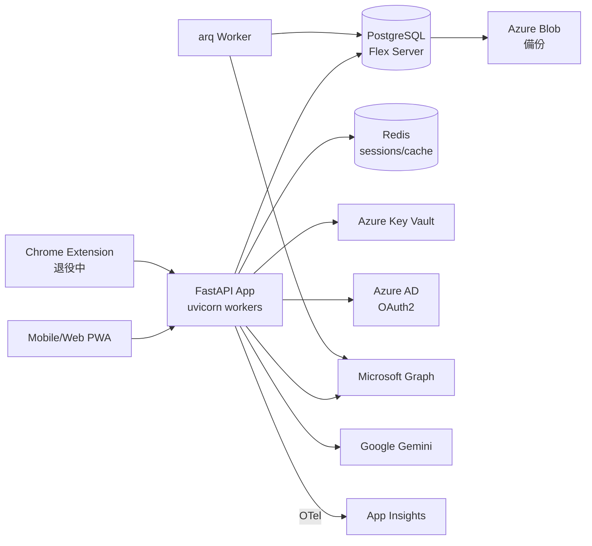

# HCAS Hub — Backend Database PRD

| Field   | Value                       |
| ------- | --------------------------- |
| Status  | Draft v1.0                  |
| Owner   | HCAS Hub Backend Team       |
| Updated | 2026-05-13                  |
| Target  | Engineering-ready handoff   |

---

## 1. Product Overview

**HCAS Hub** 是 HCAS 學生的行動優先 PWA,目前以單機 FastAPI + SQLite 提供菜單、作業、Teams、Notes 五大頁籤。本 PRD 規劃將後端升級為**多使用者、雲端、可擴展**的資料平台,並新增以下五大能力:

1. **使用者帳號系統** — Microsoft OAuth2 (Azure AD) 登入
2. **每日連續登入(Streak)** — 含 milestone 與獎勵
3. **Microsoft Graph 課表/作業同步** — 取代 Chrome extension scrape
4. **個人化主題解鎖** — milestone 達成解鎖 UI 自訂
5. **歷史與分析資料層** — 支援使用者回顧與 dashboard 統計

### 1.1 現況 vs. 目標架構

| 維度       | 現況                       | 目標                                          |
| ---------- | -------------------------- | --------------------------------------------- |
| 使用者     | 單機、無帳號               | 多租戶、Azure AD OAuth2                       |
| 資料庫     | SQLite (`data/hub.db`)     | PostgreSQL 14+ on Azure Flexible Server       |
| ORM        | 手寫 `sqlite3`             | SQLAlchemy 2.x (async) + Alembic              |
| Teams 整合 | Chrome extension scrape    | Microsoft Graph API delta sync                |
| 快取       | 無                         | Redis(session、preferences、delta token)    |
| 部署       | `uvicorn --reload` (本機)  | Azure Container Apps,水平擴展                |
| 觀測       | print/log                  | OpenTelemetry → Application Insights + Sentry |

### 1.2 技術棧

- **App**: FastAPI · Pydantic v2 · SQLAlchemy 2 (async) · Alembic · arq(背景任務)
- **資料**: PostgreSQL 14+ · Redis 7
- **基礎設施**: Azure Container Apps · Azure Cache for Redis · Azure Key Vault · Azure Blob(備份)
- **身分**: Microsoft Identity Platform (OAuth2 Authorization Code + PKCE)

---

## 2. Problem Statement

### 2.1 痛點

1. **無法多使用者** — SQLite 無認證、所有資料共用,無法投入正式運作
2. **Teams 同步脆弱** — Chrome extension scrape DOM,Microsoft UI 一改版即失效;且需學生自行安裝
3. **缺乏使用誘因** — 沒有遊戲化機制,DAU/MAU 留存難以提升
4. **歷史資料消失** — 無法回看過去 streak、評分、課表變化,無法支撐 dashboard 與成就系統

### 2.2 量化目標 (Phase 1 上線 + 6 個月)

| 指標          | 目標         |
| ------------- | ------------ |
| Monthly Active Users | ≥ 10,000     |
| API p95 延遲  | < 200 ms     |
| Uptime SLO    | 99.5%        |
| DAU / MAU     | ≥ 0.5        |
| Streak ≥ 7 天的學生比 | ≥ 30% |

---

## 3. User Stories

### 3.1 學生 (Student)

- **US-01** 身為學生,我要用 Microsoft 校園帳號一鍵登入,以便不必額外註冊。
  - AC: OAuth callback < 3 秒;首次登入自動建立 `users` 紀錄。
- **US-02** 身為學生,我要看到當前 streak 天數與最長紀錄,以便維持動機。
  - AC: 首頁顯示 `current_streak`、`longest_streak`;每日登入後即時更新。
- **US-03** 身為學生,連續登入 7/30/50/100 天我要解鎖新主題,以便有獎勵感。
  - AC: milestone 達成觸發解鎖事件,UI 顯示動畫並寫入 `user_unlocks`。
- **US-04** 身為學生,我要看到 Teams 同步來的當週課表與作業,以便不必開 Teams。
  - AC: 點「同步」< 5 秒回應;增量同步只拉變動。
- **US-05** 身為學生,我要切換主題與 dashboard 排版,並下次登入仍保留。
  - AC: 偏好寫入 `user_preferences`;載入頁面前套用。
- **US-06** 身為學生,我要查看過去 90 天的登入/評分/作業歷史,以便回顧。
  - AC: 提供 cursor 分頁、依日期降冪;p95 < 300ms。
- **US-07** 身為學生,我要可以刪除帳號(GDPR),系統應在 30 天內實體刪除。
  - AC: soft delete 立即生效;30 天 cron 實際清除。

### 3.2 管理員 (Admin)

- **US-08** 身為管理員,我要看活躍度儀表板(DAU / streak 分佈 / Teams 同步成功率)。
- **US-09** 身為管理員,我要可以替學生補償 streak(系統故障時)。
- **US-10** 身為管理員,我要可以匯出某使用者的所有資料(GDPR 請求)。

### 3.3 工程師 (Internal)

- **US-11** 身為工程師,我要 Alembic migration 可以雙向回滾。
- **US-12** 身為工程師,我要 OpenTelemetry trace 涵蓋整條請求鏈。
- **US-13** 身為工程師,我要 Postgres PITR 與每日備份,RPO ≤ 5 分鐘。
- **US-14** 身為工程師,我要 Graph token 加密落地,即使 DB 外洩也無法明文還原。
- **US-15** 身為工程師,我要每條 API 自動套用 rate limit。

---

## 4. Functional Requirements

### 4.1 使用者帳號 (User Management)

- 4.1.1 OAuth2 Authorization Code + PKCE,scope: `openid profile email offline_access User.Read Calendars.Read EduAssignments.ReadBasic`
- 4.1.2 首次登入時建立 `users` 列,寫入 `ms_oid`、`email`、`display_name`、`avatar_url`
- 4.1.3 Session 採 server-side opaque token(httpOnly cookie),refresh token 不外露
- 4.1.4 帳號刪除:`DELETE /me/account` → soft delete `deleted_at`;30 天後 cron 實體刪除
- 4.1.5 角色:`student`(預設)、`admin`(由 superadmin 手動授予)

### 4.2 每日連續登入 (Daily Login Streak)

- 4.2.1 **時區基準**:`Asia/Taipei`(學校所在地,全使用者一致)
- 4.2.2 **判定邏輯** (每次登入或心跳 `/me/streak/heartbeat`):
  - 令 `today = current_date(Asia/Taipei)`、`last = user_streaks.last_login_date`
  - 若 `last == today` → 不變
  - 若 `last == today - 1` → `current_count += 1`
  - 否則 → `current_count = 1`,寫入 `current_started_at = today`
  - 更新 `longest_count = max(longest, current)`
  - 同時 upsert `login_events(user_id, login_date)`(UNIQUE 鍵保證冪等)
- 4.2.3 **寬限期**:0 天(中斷即重置);管理員可手動補償(寫 `activity_events` 稽核)
- 4.2.4 **Milestone 觸發**(達標當下事務內處理):
  - 預設 milestone codes:`7d`、`30d`、`50d`、`100d`、`365d`
  - 達成 → 插入 `user_milestones`、解鎖對應主題到 `user_unlocks`、發 `activity_events` 事件
- 4.2.5 **查詢**:`GET /me/streak/history?from&to` 回傳指定區間內每日是否登入(填補空缺)

### 4.3 Microsoft Teams Schedule 整合

- 4.3.1 **OAuth token 儲存**:
  - access token 僅放 Redis(TTL = `expires_in`)
  - refresh token 以 AES-256-GCM 加密後存 `oauth_tokens.refresh_token_enc`
  - 加密金鑰 (DEK) 由 Azure Key Vault 取出,Envelope Encryption
- 4.3.2 **同步策略**:採 Graph **delta query** 增量同步
  - `GET /me/calendar/calendarView/delta`
  - `GET /education/me/assignments`
  - 上次 deltaLink 存 `teams_accounts.last_delta_token`
- 4.3.3 **觸發方式**:
  - 自動:每 30 分鐘背景任務(arq scheduler)
  - 手動:`POST /me/schedule/sync`(rate limit:每使用者每分鐘 1 次)
- 4.3.4 **去重與更新**:`schedule_events` 表的 UNIQUE `(user_id, source, external_id)`,upsert 邏輯;`raw_payload` JSONB 保留原始資料供回放
- 4.3.5 **錯誤處理**:token 失效自動 refresh;refresh 失敗 → `sync_status='error'`,使用者下次登入提示重新授權
- 4.3.6 **向後相容**:保留 `POST /api/import_assignments` 端點,但要求 Bearer token、寫入 `source='extension'`;Graph 模式穩定後排程退役

### 4.4 個人化主題 (Customization)

- 4.4.1 主題目錄存 `themes`(預設由 seed 載入:default、ocean、sunset、midnight、aurora、retro、…)
- 4.4.2 每個主題的 `unlock_rule` JSONB 範例:`{"type": "milestone", "code": "30d"}` 或 `{"type": "default"}`
- 4.4.3 milestone 達成 → 自動寫 `user_unlocks(user_id, theme_id, source='milestone')`
- 4.4.4 使用者切換主題:`PUT /me/preferences { active_theme_id }`(必須已 unlock)
- 4.4.5 自訂項目:`palette overrides`、`font`(預設清單)、`dashboard_layout`(卡片順序 JSON)、`badge_config`
- 4.4.6 每次變更寫 `activity_events(event_type='theme_changed')` 供歷史查詢

### 4.5 歷史與分析 (History & Analytics)

- 4.5.1 統一事件流:`activity_events(user_id, event_type, payload JSONB, occurred_at)`
  - event_type 列舉:`login`、`streak_break`、`milestone_unlocked`、`theme_changed`、`schedule_synced`、`assignment_completed`、`lunch_rated`、…
- 4.5.2 **分區**:`RANGE BY occurred_at`(月)、`pg_partman` 自動建/丟分區(保留 24 個月)
- 4.5.3 **物化視圖**:`mv_user_daily_summary`(每晚 02:00 refresh)— 提供 dashboard 快速查詢
- 4.5.4 查詢 API:`GET /me/history?type&from&to&cursor`(cursor-based 分頁)

---

## 5. Database Schema Proposal ★

### 5.1 ER 圖



### 5.2 DDL(PostgreSQL 14+)

> 注意:依下方順序執行(FK 依賴);全部欄位採用 `IF NOT EXISTS` 慣例;`updated_at` 由 trigger 自動維護(略)。

```sql
-- ============ Extensions ============
CREATE EXTENSION IF NOT EXISTS pgcrypto;
CREATE EXTENSION IF NOT EXISTS citext;
CREATE EXTENSION IF NOT EXISTS btree_gin;

-- ============ ENUM types ============
CREATE TYPE user_role        AS ENUM ('student', 'admin');
CREATE TYPE oauth_provider   AS ENUM ('microsoft');
CREATE TYPE event_source     AS ENUM ('graph', 'extension', 'manual');
CREATE TYPE event_type_t     AS ENUM ('class', 'meeting', 'assignment', 'club', 'other');
CREATE TYPE sync_status      AS ENUM ('ok', 'pending', 'error');
CREATE TYPE unlock_source    AS ENUM ('milestone', 'admin', 'default');

-- ============ users ============
CREATE TABLE users (
  id              UUID PRIMARY KEY DEFAULT gen_random_uuid(),
  ms_oid          TEXT        NOT NULL UNIQUE,
  email           CITEXT      NOT NULL UNIQUE,
  display_name    TEXT        NOT NULL,
  avatar_url      TEXT,
  role            user_role   NOT NULL DEFAULT 'student',
  created_at      TIMESTAMPTZ NOT NULL DEFAULT now(),
  last_login_at   TIMESTAMPTZ,
  deleted_at      TIMESTAMPTZ
);
CREATE INDEX ix_users_last_login ON users(last_login_at DESC) WHERE deleted_at IS NULL;

-- ============ oauth_tokens (1:1) ============
CREATE TABLE oauth_tokens (
  user_id              UUID PRIMARY KEY REFERENCES users(id) ON DELETE CASCADE,
  provider             oauth_provider NOT NULL DEFAULT 'microsoft',
  refresh_token_enc    BYTEA       NOT NULL,    -- AES-256-GCM ciphertext
  refresh_token_iv     BYTEA       NOT NULL,    -- 12-byte IV
  dek_kid              TEXT        NOT NULL,    -- KMS key id used to wrap DEK
  scopes               TEXT[]      NOT NULL,
  expires_at           TIMESTAMPTZ NOT NULL,
  updated_at           TIMESTAMPTZ NOT NULL DEFAULT now()
);

-- ============ sessions ============
CREATE TABLE sessions (
  id                   UUID PRIMARY KEY DEFAULT gen_random_uuid(),
  user_id              UUID NOT NULL REFERENCES users(id) ON DELETE CASCADE,
  refresh_token_hash   BYTEA NOT NULL,        -- HMAC-SHA256
  ip_hash              BYTEA,
  user_agent           TEXT,
  created_at           TIMESTAMPTZ NOT NULL DEFAULT now(),
  expires_at           TIMESTAMPTZ NOT NULL,
  revoked_at           TIMESTAMPTZ
);
CREATE INDEX ix_sessions_user ON sessions(user_id) WHERE revoked_at IS NULL;

-- ============ user_streaks (1:1) ============
CREATE TABLE user_streaks (
  user_id              UUID PRIMARY KEY REFERENCES users(id) ON DELETE CASCADE,
  current_count        INT  NOT NULL DEFAULT 0,
  longest_count        INT  NOT NULL DEFAULT 0,
  last_login_date      DATE,
  current_started_at   DATE,
  updated_at           TIMESTAMPTZ NOT NULL DEFAULT now()
);

-- ============ login_events ============
CREATE TABLE login_events (
  id          BIGSERIAL PRIMARY KEY,
  user_id     UUID NOT NULL REFERENCES users(id) ON DELETE CASCADE,
  login_date  DATE        NOT NULL,
  login_at    TIMESTAMPTZ NOT NULL DEFAULT now(),
  source      TEXT        NOT NULL DEFAULT 'web',
  ip_hash     BYTEA,
  UNIQUE (user_id, login_date)
);
CREATE INDEX ix_login_events_user_date ON login_events(user_id, login_date DESC);

-- ============ streak_milestones (catalog) ============
CREATE TABLE streak_milestones (
  id              SERIAL PRIMARY KEY,
  code            TEXT UNIQUE NOT NULL,   -- '7d','30d','50d','100d','365d'
  threshold_days  INT  NOT NULL,
  reward_type     TEXT NOT NULL,          -- 'theme' | 'badge'
  reward_payload  JSONB NOT NULL          -- {"theme_code": "ocean"}
);

-- ============ user_milestones ============
CREATE TABLE user_milestones (
  user_id       UUID NOT NULL REFERENCES users(id) ON DELETE CASCADE,
  milestone_id  INT  NOT NULL REFERENCES streak_milestones(id),
  achieved_at   TIMESTAMPTZ NOT NULL DEFAULT now(),
  PRIMARY KEY (user_id, milestone_id)
);

-- ============ teams_accounts (1:1) ============
CREATE TABLE teams_accounts (
  user_id           UUID PRIMARY KEY REFERENCES users(id) ON DELETE CASCADE,
  ms_user_id        TEXT NOT NULL,
  tenant_id         TEXT NOT NULL,
  last_sync_at      TIMESTAMPTZ,
  last_delta_token  TEXT,
  sync_status       sync_status NOT NULL DEFAULT 'pending',
  last_error        TEXT
);

-- ============ schedule_events ============
CREATE TABLE schedule_events (
  id            UUID PRIMARY KEY DEFAULT gen_random_uuid(),
  user_id       UUID         NOT NULL REFERENCES users(id) ON DELETE CASCADE,
  source        event_source NOT NULL,
  external_id   TEXT,
  title         TEXT         NOT NULL,
  subject       TEXT,
  event_type    event_type_t NOT NULL DEFAULT 'other',
  start_at      TIMESTAMPTZ,
  end_at        TIMESTAMPTZ,
  location      TEXT,
  teams_join_url TEXT,
  is_done       BOOLEAN      NOT NULL DEFAULT FALSE,
  priority      INT          DEFAULT 50,
  raw_payload   JSONB,
  created_at    TIMESTAMPTZ  NOT NULL DEFAULT now(),
  updated_at    TIMESTAMPTZ  NOT NULL DEFAULT now(),
  deleted_at    TIMESTAMPTZ,
  UNIQUE (user_id, source, external_id)
);
CREATE INDEX ix_sched_user_start
  ON schedule_events(user_id, start_at)
  WHERE deleted_at IS NULL;
CREATE INDEX ix_sched_user_type
  ON schedule_events(user_id, event_type, start_at)
  WHERE deleted_at IS NULL;

-- ============ themes (catalog) ============
CREATE TABLE themes (
  id            SERIAL PRIMARY KEY,
  code          TEXT UNIQUE NOT NULL,
  name          TEXT NOT NULL,
  palette       JSONB NOT NULL,
  font          TEXT,
  preview_url   TEXT,
  unlock_rule   JSONB NOT NULL,           -- {"type":"milestone","code":"30d"}
  is_active     BOOLEAN NOT NULL DEFAULT TRUE
);

-- ============ user_unlocks ============
CREATE TABLE user_unlocks (
  user_id     UUID NOT NULL REFERENCES users(id) ON DELETE CASCADE,
  theme_id    INT  NOT NULL REFERENCES themes(id),
  unlocked_at TIMESTAMPTZ NOT NULL DEFAULT now(),
  source      unlock_source NOT NULL,
  PRIMARY KEY (user_id, theme_id)
);

-- ============ user_preferences (1:1) ============
CREATE TABLE user_preferences (
  user_id           UUID PRIMARY KEY REFERENCES users(id) ON DELETE CASCADE,
  active_theme_id   INT REFERENCES themes(id),
  dashboard_layout  JSONB NOT NULL DEFAULT '{}'::jsonb,
  badge_config      JSONB NOT NULL DEFAULT '{}'::jsonb,
  updated_at        TIMESTAMPTZ NOT NULL DEFAULT now()
);

-- ============ activity_events (partitioned) ============
CREATE TABLE activity_events (
  id           BIGSERIAL,
  user_id      UUID NOT NULL,
  event_type   TEXT NOT NULL,
  payload      JSONB NOT NULL DEFAULT '{}'::jsonb,
  occurred_at  TIMESTAMPTZ NOT NULL DEFAULT now(),
  request_id   TEXT,
  PRIMARY KEY (id, occurred_at)
) PARTITION BY RANGE (occurred_at);

CREATE INDEX ix_activity_user_time
  ON activity_events(user_id, occurred_at DESC);
CREATE INDEX brin_activity_time
  ON activity_events USING BRIN (occurred_at);

-- (pg_partman 設定:每月自動建立分區,保留 24 個月,過期分區搬去 cold storage)

-- ============ lunch_ratings(改寫,綁 user) ============
CREATE TABLE lunch_ratings (
  id          BIGSERIAL PRIMARY KEY,
  user_id     UUID NOT NULL REFERENCES users(id) ON DELETE CASCADE,
  day         DATE NOT NULL,
  stars       SMALLINT NOT NULL CHECK (stars BETWEEN 1 AND 5),
  comment     TEXT,
  created_at  TIMESTAMPTZ NOT NULL DEFAULT now(),
  UNIQUE (user_id, day)                 -- 一人每天一票
);
CREATE INDEX ix_lunch_day ON lunch_ratings(day);
```

### 5.3 物化視圖

```sql
CREATE MATERIALIZED VIEW mv_user_daily_summary AS
SELECT
  u.id  AS user_id,
  (SELECT current_count FROM user_streaks WHERE user_id = u.id) AS streak,
  (SELECT COUNT(*) FROM schedule_events
     WHERE user_id = u.id AND deleted_at IS NULL
       AND start_at >= now() - interval '7 days') AS events_last_7d,
  (SELECT AVG(stars) FROM lunch_ratings
     WHERE user_id = u.id AND day >= current_date - 30) AS lunch_avg_30d
FROM users u WHERE deleted_at IS NULL;

CREATE UNIQUE INDEX ON mv_user_daily_summary(user_id);
-- 每晚 02:00 由 cron 執行 REFRESH MATERIALIZED VIEW CONCURRENTLY
```

### 5.4 從現有 SQLite 遷移

- 既有 `assignments` → `schedule_events`(`source='extension'`、`event_type='assignment'`)
- 既有 `lunch_ratings`(無 user_id) → 全部歸給 seeded `system_legacy` user 或標記丟棄
- 詳細 migration SQL 見 Appendix C

---

## 6. API Requirements

### 6.1 共用規範

- **Base path**: `/api/v1`
- **Auth**: `Authorization: Bearer <opaque_session_token>`(由 cookie 與 header 雙模式支援)
- **錯誤格式**: `{ "error": { "code": "STRING", "message": "...", "request_id": "..." } }`
- **分頁**: cursor-based,回應 envelope `{ "data": [...], "next_cursor": "..." }`,預設 `size=20`、最大 `size=100`
- **Rate limit**: 預設 60 req/min/user,敏感端點(`/auth/*`、`/sync`)額外限制
- **Idempotency**: 寫入端點接受 `Idempotency-Key` header

### 6.2 端點清單

| Method | Path                                    | Auth     | 說明                              |
| ------ | --------------------------------------- | -------- | --------------------------------- |
| GET    | `/auth/microsoft/login`                 | public   | 產生 PKCE state、302 至 Microsoft |
| GET    | `/auth/microsoft/callback`              | public   | 交換 code,建立 session           |
| POST   | `/auth/refresh`                         | session  | 換新 session token                |
| POST   | `/auth/logout`                          | session  | 撤銷 session                      |
| GET    | `/me`                                   | session  | 使用者 profile                    |
| DELETE | `/me/account`                           | session  | 帳號刪除(soft)                  |
| GET    | `/me/streak`                            | session  | 當前 streak 與 milestones         |
| POST   | `/me/streak/heartbeat`                  | session  | 心跳(idempotent by date)        |
| GET    | `/me/streak/history?from&to`            | session  | 區間每日登入旗標                  |
| GET    | `/me/schedule?from&to&type&cursor`      | session  | 課表與作業                        |
| POST   | `/me/schedule/sync`                     | session  | 觸發 Graph delta                  |
| PATCH  | `/me/schedule/{id}`                     | session  | 更新(如標記完成)               |
| DELETE | `/me/schedule/{id}`                     | session  | 軟刪                              |
| GET    | `/themes`                               | session  | 全部主題目錄                      |
| GET    | `/me/themes`                            | session  | 含 locked/unlocked 狀態           |
| GET    | `/me/preferences`                       | session  | 取得偏好                          |
| PUT    | `/me/preferences`                       | session  | 更新偏好                          |
| GET    | `/me/history?type&from&to&cursor`       | session  | 事件流                            |
| GET    | `/me/analytics/summary`                 | session  | dashboard 彙總                    |
| POST   | `/me/lunch/rate`                        | session  | 評分(取代 `/lunch/rate`)       |
| POST   | `/api/import_assignments`               | session  | 向後相容(Chrome ext,將退役)   |
| GET    | `/admin/users?cursor`                   | admin    | 使用者清單                        |
| POST   | `/admin/streak/{user_id}/reset`         | admin    | 重置/補償 streak                  |
| GET    | `/admin/metrics`                        | admin    | 平台指標                          |

### 6.3 OpenAPI 樣板片段

```yaml
openapi: 3.1.0
info: { title: HCAS Hub API, version: 1.0.0 }
paths:
  /api/v1/me/streak:
    get:
      summary: 取得當前 streak 狀態
      security: [{ bearerAuth: [] }]
      responses:
        '200':
          content:
            application/json:
              schema:
                type: object
                properties:
                  current_count: { type: integer, example: 14 }
                  longest_count: { type: integer, example: 42 }
                  last_login_date: { type: string, format: date }
                  milestones:
                    type: array
                    items:
                      type: object
                      properties:
                        code: { type: string, example: '7d' }
                        achieved_at: { type: string, format: date-time }

  /api/v1/me/schedule/sync:
    post:
      summary: 觸發 Microsoft Graph 增量同步
      security: [{ bearerAuth: [] }]
      responses:
        '202':
          content:
            application/json:
              schema:
                type: object
                properties:
                  job_id: { type: string }
                  status: { type: string, enum: [queued, running] }
        '429': { description: Rate limit (1 / min / user) }

components:
  securitySchemes:
    bearerAuth: { type: http, scheme: bearer }
```

---

## 7. Security Architecture

### 7.1 Authentication

- Microsoft Identity Platform OAuth2 **Authorization Code + PKCE**
- `state` 參數綁定 server-side(Redis,TTL 10 分鐘),防 CSRF
- session token 為 opaque random 256-bit,寫入 `Secure; HttpOnly; SameSite=Lax` cookie
- access token 永不交付前端;refresh token 永不從 DB 解密回應到客戶端

### 7.2 Authorization

- RBAC:`student` | `admin`,FastAPI dependency `require_role()`
- **Row-level isolation**:所有 user-owned 表查詢 強制 `WHERE user_id = current_user.id`;以 SQLAlchemy session listener + repository base class 雙重保險
- 進階:可導入 Postgres Row Level Security policy 作為 defense-in-depth

### 7.3 Secrets & Encryption

| 內容               | 方法                                           |
| ------------------ | ---------------------------------------------- |
| Refresh token     | AES-256-GCM,DEK 由 Azure Key Vault wrap (KEK) |
| Session token DB  | 只存 HMAC-SHA256 hash                         |
| Password          | 不存(全 OAuth)                              |
| Env secrets       | Azure Key Vault + CSI driver,絕不入 git       |

### 7.4 傳輸與標頭

- TLS 1.2+ only;HSTS 1 年;CSP `default-src 'self'`
- CORS allowlist:正式網域 + 開發 localhost
- Security headers:`X-Content-Type-Options: nosniff`、`Referrer-Policy: same-origin`、`Permissions-Policy` 鎖死

### 7.5 API 防護

- Rate limit:SlowAPI + Redis token bucket
- Input validation:Pydantic v2 嚴格模式 + `Field(..., max_length=)`
- SQL injection:全用 SQLAlchemy ORM,不允許 raw f-string SQL
- CSRF:cookie 模式下使用 double-submit cookie + `Origin/Referer` 比對

### 7.6 OWASP Top 10 (2021) 對照

| ID    | 名稱                                | 緩解措施                                                |
| ----- | ----------------------------------- | ------------------------------------------------------- |
| A01   | Broken Access Control               | RBAC + row-level isolation + RLS policy                 |
| A02   | Cryptographic Failures              | AES-256-GCM + KMS;TLS 1.2+                              |
| A03   | Injection                           | ORM + Pydantic validation;絕無 raw SQL                  |
| A04   | Insecure Design                     | Threat model 評審;敏感 endpoint code review            |
| A05   | Security Misconfiguration           | 容器以 non-root 使用者執行;最小化 image;security headers|
| A06   | Vulnerable Components               | Dependabot + `pip-audit` CI                             |
| A07   | Identification/Auth Failures        | OAuth2 PKCE;session 30 天滾動 + 重新登入              |
| A08   | Software & Data Integrity           | 容器映像簽章(cosign);SBOM 產出                       |
| A09   | Logging & Monitoring Failures       | 結構化日誌 + Sentry + 敏感事件稽核                      |
| A10   | SSRF                                | 出站允許清單(Graph API、Gemini)                       |

### 7.7 隱私 / GDPR

- `DELETE /me/account` → soft delete,30 天後 cron 實體 hard delete(含 `oauth_tokens`、`schedule_events.raw_payload`、`activity_events`)
- `GET /me/export` → 產生 JSON zip 包,signed URL 24 小時有效
- 稽核日誌:`activity_events` 紀錄 admin 動作(reset streak / 匯出 / 刪除)

---

## 8. System Architecture

### 8.1 元件圖



### 8.2 模組分層

對齊 `super_app` 慣例(Model / Repository / Service / Controller):

```
hcas-hub/
├── app/
│   ├── api/v1/             # FastAPI routers
│   ├── services/           # 商業邏輯 (StreakService, GraphSyncService, ThemeService)
│   ├── repositories/       # DB 存取 (UserRepo, ScheduleRepo, ...)
│   ├── models/             # SQLAlchemy models
│   ├── core/               # config, security, crypto, telemetry
│   └── workers/            # arq tasks
├── migrations/             # Alembic
└── tests/
```

### 8.3 背景任務

| 任務               | 排程         | 內容                                              |
| ------------------ | ------------ | ------------------------------------------------- |
| `sync_teams_delta` | 每 30 分鐘   | 對所有 `teams_accounts.sync_status='ok'` 跑 delta |
| `refresh_mv`       | 每日 02:00   | `REFRESH MATERIALIZED VIEW CONCURRENTLY`          |
| `hard_delete`      | 每日 03:00   | 清除 `deleted_at < now() - 30d` 的使用者          |
| `partition_maint`  | 每日 04:00   | pg_partman 建/丟分區                              |
| `token_refresh`    | 每 15 分鐘   | 提前刷新即將過期的 Graph access token             |

### 8.4 部署

- Azure Container Apps:HTTP scale rule(target concurrency 100)
- DB:Azure Postgres Flexible Server(General Purpose, 2 vCore,read replica × 1)
- Redis:Azure Cache for Redis Standard C1
- CI/CD:GitHub Actions → ruff / mypy / pytest → 建 image → ACR → Container Apps 滾動部署
- 環境:`dev`、`staging`、`prod` 隔離

### 8.5 遷移路徑(Phase 化)

| Phase   | 內容                                                          |
| ------- | ------------------------------------------------------------- |
| **0**   | 切換 ORM 為 SQLAlchemy 2;不動 schema;CI 補齊                |
| **1**   | 加 `users` / `oauth_tokens` / `sessions`;接 Azure AD OAuth   |
| **2**   | 加 streak + `activity_events`(分區)                         |
| **3**   | Graph API 取代 extension;`schedule_events` 上線              |
| **4**   | Customization + 物化視圖 + Admin dashboard                   |

---

## 9. Scalability Considerations

### 9.1 資料庫

- **連線池**:pgbouncer transaction pooling,max_client_conn=1000
- **讀寫分離**:Analytics 查詢 (`/me/history`、admin metrics) 走 read replica
- **分區**:`activity_events`、`login_events` 按月 RANGE 分區
- **索引策略**

| 表                | 主要查詢                            | 索引                              |
| ----------------- | ----------------------------------- | --------------------------------- |
| `users`           | 依 ms_oid / email 登入              | UNIQUE(ms_oid)、UNIQUE(email)     |
| `schedule_events` | 取使用者一週課表                    | (user_id, start_at)               |
| `login_events`    | 計算 streak                         | (user_id, login_date DESC)        |
| `activity_events` | 使用者歷史(時間範圍)              | (user_id, occurred_at DESC) + BRIN(occurred_at) |
| `lunch_ratings`   | 某日平均星數                        | (day)                             |

### 9.2 快取

- Redis 快取項目:`user_preferences:{user_id}`、`active_theme:{user_id}`、`me_profile:{user_id}`
- 失效:寫入時主動刪 key;TTL 兜底 10 分鐘
- Graph `last_delta_token` 同步寫 Redis(熱資料) + Postgres(持久化)

### 9.3 分頁

- 全部 list 端點採 **cursor-based**(opaque base64,內含 `last_id` + `last_occurred_at`)
- 禁止 `OFFSET > 1000`

### 9.4 備份與災難復原

| 項目  | 設定                              |
| ----- | --------------------------------- |
| PITR  | 開啟,保留 35 天                  |
| 邏輯備份 | 每日 `pg_dump` → Blob,保留 90 天 |
| RPO   | ≤ 5 分鐘                          |
| RTO   | ≤ 1 小時                          |
| 演練  | 每季從備份還原至 staging 驗證     |

### 9.5 容量規劃

| 規模           | DAU      | Postgres   | Redis     | App Container |
| -------------- | -------- | ---------- | --------- | ------------- |
| MVP            | < 100    | Burstable B1ms | C0     | 1 × 0.5 vCPU  |
| Growth         | < 1k     | GP 2vCore  | C1        | 2 × 1 vCPU    |
| Production     | < 10k    | GP 4vCore + replica | C2 | 4–8 × 1 vCPU  |
| Scale          | < 100k   | MO 8vCore + 2 replicas | C3 cluster | 16+ auto-scale |

### 9.6 負載目標

- 200 RPS / p95 < 200ms / DB CPU < 60% / Redis hit ratio > 90%

---

## 10. Future Expansion Possibilities

1. **多角色** — 家長、老師、行政,可看見授權範圍內的學生資料
2. **Push 通知** — Web Push + FCM,推送 streak 警示與課程提醒
3. **多日曆來源** — Apple Calendar / Google Calendar(`source` enum 已預留;Strategy pattern)
4. **AI 學習助理** — 整合 Notes(Gemini),加上個人化 RAG(讀使用者課表/作業)
5. **社交 / Streak 競賽** — 朋友系統、跨班/跨校排行榜、共同 milestone
6. **行動原生 App** — React Native 共用同一組 REST API
7. **多租戶(多學校)** — 加 `tenants` 表 + Postgres Row Level Security policy
8. **開放 API + Webhook** — 提供第三方整合(課外活動社團系統等)
9. **學生健康整合** — 銜接 `calories/MyCam` 子專案,做整體 wellness dashboard
10. **付費高階主題 / 校內商店** — Stripe + `user_unlocks(source='purchase')`

---

## Appendix

### A. Glossary

- **Streak**:連續每日登入的天數
- **Milestone**:預定的 streak 門檻(7/30/50/100/365 天)
- **Delta token**:Microsoft Graph 用以取得增量變動的 opaque cursor
- **PKCE**:Proof Key for Code Exchange,OAuth2 防中間人攔截 code 的擴充
- **DEK / KEK**:Data Encryption Key / Key Encryption Key(envelope encryption)

### B. 環境變數

| Key                              | 用途                          |
| -------------------------------- | ----------------------------- |
| `DATABASE_URL`                   | Postgres DSN                  |
| `REDIS_URL`                      | Redis DSN                     |
| `AZURE_TENANT_ID`                | AAD tenant                    |
| `AZURE_CLIENT_ID`                | App registration              |
| `AZURE_CLIENT_SECRET`            | (Key Vault reference)         |
| `OAUTH_REDIRECT_URI`             | OAuth callback                |
| `KEY_VAULT_URL`                  | Azure Key Vault endpoint      |
| `TOKEN_ENCRYPTION_KEY_NAME`      | KEK 名稱                      |
| `GOOGLE_API_KEY`                 | Gemini(notes)                |
| `SENTRY_DSN`                     | 錯誤回報                      |
| `APPLICATIONINSIGHTS_CONNECTION_STRING` | OTel exporter           |

### C. SQLite → Postgres Migration SQL(範例)

```sql
-- 將既有 SQLite 的 assignments 匯出為 CSV,然後:
INSERT INTO schedule_events
  (user_id, source, external_id, title, subject, event_type,
   start_at, is_done, priority, created_at, updated_at)
SELECT
  '<system_legacy_user_uuid>'::uuid,
  CASE WHEN old.source = 'teams' THEN 'extension'::event_source
       ELSE 'manual'::event_source END,
  old.external_id,
  old.title,
  old.subject,
  'assignment'::event_type_t,
  old.due_at::timestamptz,
  old.done = 1,
  old.priority,
  old.created_at::timestamptz,
  COALESCE(old.updated_at::timestamptz, now())
FROM legacy_assignments old
ON CONFLICT (user_id, source, external_id) DO NOTHING;
```

### D. 需求覆蓋對照表

| 需求書條目                        | PRD 章節 / 表           |
| --------------------------------- | ------------------------ |
| User ID / Email / 登入時間…       | §4.1 / `users`           |
| 連續登入天數 / 最長紀錄           | §4.2 / `user_streaks`    |
| 每日登入歷史                      | `login_events`           |
| Milestone 達成                    | `user_milestones` + `streak_milestones` |
| Teams User ID / Tokens            | `teams_accounts` + `oauth_tokens` |
| 同步課程資料(名稱/時間/類型/link) | `schedule_events`        |
| 最後同步時間 / 狀態               | `teams_accounts.last_sync_at` / `sync_status` |
| 已解鎖主題 / 目前使用主題         | `user_unlocks` / `user_preferences` |
| 自訂 UI 設定                      | `user_preferences.dashboard_layout / badge_config` |
| streak/login/sync/custom/achievement history | `activity_events` |
| Encrypted token storage           | §7.3                     |
| Role-based access control         | §7.2                     |
| User data isolation               | §7.2(repo enforced)    |
| Multi-user concurrent / indexing / caching / pagination / backup | §9 |

### E. 風險登記簿(Top 5)

| 風險                                       | 影響 | 機率 | 緩解                                            |
| ------------------------------------------ | ---- | ---- | ----------------------------------------------- |
| 校方 IT 不核發 Azure AD app                | 高   | 中   | Fallback:保留 extension-only 模式;PRD 加註替代 |
| Graph API 配額/節流                        | 中   | 中   | 增量 delta + 退避重試 + per-user 排隊           |
| Token 加密金鑰外洩                         | 高   | 低   | KMS、key rotation 90 天、稽核警報              |
| 活動事件表暴漲拖慢查詢                     | 中   | 中   | 月分區 + BRIN + 24 個月保留窗                  |
| Streak 因系統故障被誤中斷,引發大量客訴   | 中   | 低   | 管理員補償工具 + 事件稽核 + SLA 監控           |

---

*End of PRD v1.0 — ready for engineering kickoff.*
